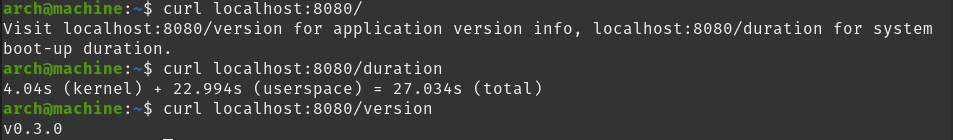

# System Info Server
Simple RESTful Web Service server application that returns system boot-up duration

## Building
`go build`

## Usage
`./SystemInfoServer [port]`

or if you wish to run without building:

`go run . [port]`

Default port is 8080, which will be chosen if no port is supplied
